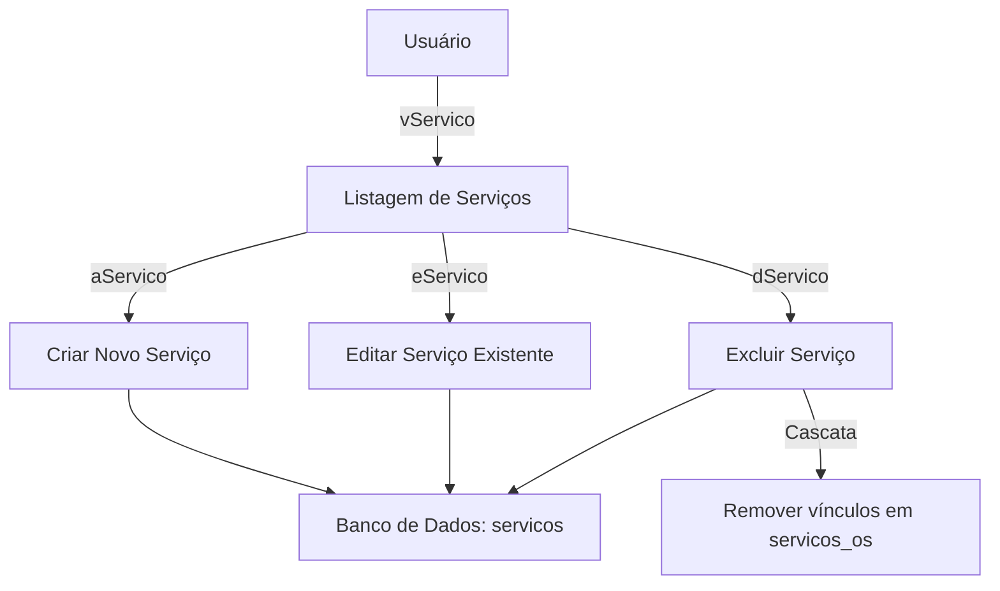

# Documentação: Módulo de Serviços (MapOS)

Este documento descreve detalhadamente as funcionalidades e funções técnicas que compõem o módulo de **Serviços** na aplicação MapOS.

---

## 1. Visão Geral do Módulo

O módulo de **Serviços** gerencia as atividades de mão de obra e serviços oferecidos pela empresa no MapOS. Ele se integra diretamente com as **Ordens de Serviço (OS)**, permitindo associar e faturar os serviços prestados a cada cliente.

---

## 2. Fluxo de Funcionalidades

### 2.1. Funcionalidades de Interface:
1. **Cadastro**: Interface simplificada com validação local (jQuery Validate) e máscara monetária para o preço (`maskmoney.js`).
2. **Busca e Paginação**: Campo de pesquisa textual que filtra serviços por nome ou descrição, com navegação paginada para grandes volumes de registros.
3. **Controle de Acesso**: Valida as permissões do usuário em cada etapa (visualização, adição, edição, exclusão).
4. **Histórico e Logs**: Toda criação, alteração ou exclusão gera um registro de auditoria via função `log_info()`.

---

## 3. Estrutura do Banco de Dados

### Tabela `servicos`
Registra a definição de cada serviço cadastrável no sistema.

| Campo | Tipo | Descrição | Restrições |
| :--- | :--- | :--- | :--- |
| `idServicos` | `INT(11)` | Identificador único do serviço | Primary Key, Auto Increment |
| `nome` | `VARCHAR(45)` | Nome amigável do serviço | NOT NULL |
| `descricao` | `VARCHAR(45)` | Breve explicação sobre o serviço | NULL |
| `preco` | `DECIMAL(10,2)` | Preço unitário do serviço | NOT NULL |

### Tabela `servicos_os`
Associa os serviços cadastrados às Ordens de Serviço correspondentes.

| Campo | Tipo | Descrição | Restrições |
| :--- | :--- | :--- | :--- |
| `idServicos_os` | `INT(11)` | Identificador da relação | Primary Key, Auto Increment |
| `servico` | `VARCHAR(80)` | Nome do serviço no momento da associação | NULL |
| `quantidade` | `DOUBLE` | Quantidade executada na OS | NULL |
| `preco` | `DECIMAL(10,2)` | Preço cobrado na OS | NULL, Default 0 |
| `os_id` | `INT(11)` | ID da Ordem de Serviço relacionada | Foreign Key (tabela `os`) |
| `servicos_id` | `INT(11)` | ID do Serviço relacionado | Foreign Key (tabela `servicos`) |
| `subTotal` | `DECIMAL(10,2)` | Total calculado (preco * quantidade) | NULL, Default 0 |

---

## 4. Estrutura de Métodos e Funções

### 4.1. Controller: [Servicos.php](file:///C:/xampp/htdocs/application/controllers/Servicos.php)
Responsável por interceptar as requisições HTTP, aplicar validações de permissão/formulário e interagir com o Model e View.

- `__construct()`
  Carrega os recursos necessários (`form` helper, `servicos_model`) e define a marcação do menu ativo.
- `index()`
  Apenas redireciona a execução padrão para o método `gerenciar()`.
- `gerenciar()`
  - Valida se o perfil logado possui a permissão `vServico`.
  - Configura parâmetros de paginação e recupera os termos de filtro informados em `pesquisa`.
  - Retorna a lista de serviços para a view `servicos/servicos`.
- `adicionar()`
  - Valida se o perfil possui a permissão `aServico`.
  - Executa validações de formulário (nome e preço obrigatórios).
  - Trata o valor monetário removendo delimitadores.
  - Insere o registro via model, gera log de auditoria (`log_info`) e redireciona o usuário.
- `editar()`
  - Valida se o ID fornecido no parâmetro da URL existe e é numérico.
  - Valida se o perfil possui a permissão `eServico`.
  - Processa a submissão do formulário atualizando o registro.
- `excluir()`
  - Valida se o perfil possui a permissão `dServico`.
  - Executa a remoção em cascata (deleta primeiro na tabela associativa `servicos_os` e depois na tabela `servicos`).

### 4.2. Model: [Servicos_model.php](file:///C:/xampp/htdocs/application/models/Servicos_model.php)
Realiza a comunicação direta com o banco de dados via Active Record do CodeIgniter.

- `get($table, $fields, $where, $perpage, $start, $one, $array)`: Realiza consultas complexas na tabela `servicos`, incluindo cláusulas `LIKE` e `OR_LIKE` para busca textual e limites para paginação.
- `getById($id)`: Executa um `where` buscando especificamente pelo ID do serviço.
- `add($table, $data)`: Executa o comando de inserção no banco de dados.
- `edit($table, $data, $fieldID, $ID)`: Atualiza os registros aplicando a condição ID.
- `delete($table, $fieldID, $ID)`: Remove o registro correspondente ao ID informado.
- `count($table)`: Retorna o total geral de registros cadastrados para a paginação.

---

## 5. Permissões de Acesso Associadas

| Código da Permissão | Nome Amigável | Descrição |
| :--- | :--- | :--- |
| `vServico` | Visualizar Serviço | Permite listar e buscar serviços no catálogo |
| `aServico` | Adicionar Serviço | Permite cadastrar um novo serviço |
| `eServico` | Editar Serviço | Permite alterar dados de um serviço existente |
| `dServico` | Deletar Serviço | Permite remover permanentemente um serviço |
